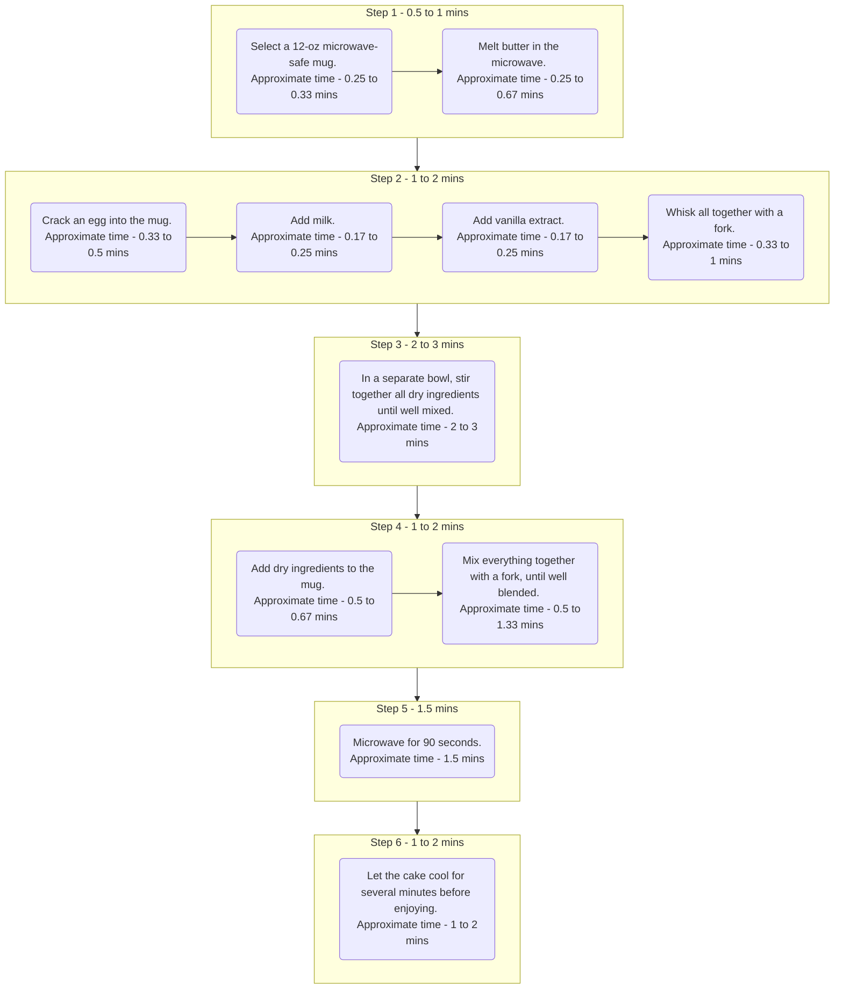

```mermaid
flowchart TD

subgraph step_1[Step 1 - 0.5 to 1 mins]
step_1_sub1("`Select a 12-oz microwave-safe mug. 

 Approximate time - 0.25 to 0.33 mins`") 
step_1_sub2("`Melt butter in the microwave. 

 Approximate time - 0.25 to 0.67 mins`") 
step_1_sub1 --> step_1_sub2
end
subgraph step_2[Step 2 - 1 to 2 mins]
step_2_sub1("`Crack an egg into the mug. 

 Approximate time - 0.33 to 0.5 mins`") 
step_2_sub2("`Add milk. 

 Approximate time - 0.17 to 0.25 mins`") 
step_2_sub3("`Add vanilla extract. 

 Approximate time - 0.17 to 0.25 mins`") 
step_2_sub4("`Whisk all together with a fork. 

 Approximate time - 0.33 to 1 mins`") 
step_2_sub1 --> step_2_sub2 --> step_2_sub3 --> step_2_sub4
end
subgraph step_3[Step 3 - 2 to 3 mins]
step_3_sub1("`In a separate bowl, stir together all dry ingredients until well mixed. 

 Approximate time - 2 to 3 mins`") 
step_3_sub1
end
subgraph step_4[Step 4 - 1 to 2 mins]
step_4_sub1("`Add dry ingredients to the mug. 

 Approximate time - 0.5 to 0.67 mins`") 
step_4_sub2("`Mix everything together with a fork, until well blended. 

 Approximate time - 0.5 to 1.33 mins`") 
step_4_sub1 --> step_4_sub2
end
subgraph step_5[Step 5 - 1.5 mins]
step_5_sub1("`Microwave for 90 seconds. 

 Approximate time - 1.5 mins`") 
step_5_sub1
end
subgraph step_6[Step 6 - 1 to 2 mins]
step_6_sub1("`Let the cake cool for several minutes before enjoying. 

 Approximate time - 1 to 2 mins`") 
step_6_sub1
end

step_1 --> step_2 --> step_3 --> step_4 --> step_5 --> step_6
```